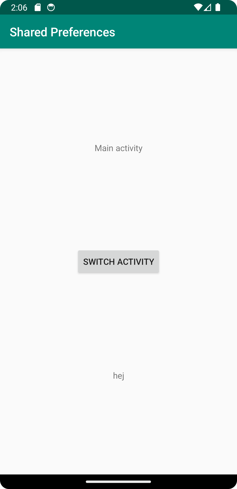
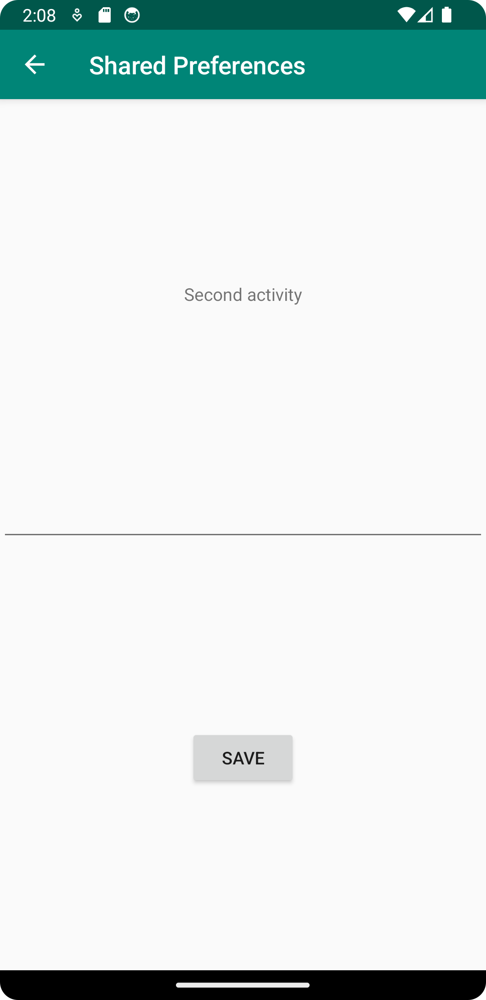

# Rapport

Denna uppgift gick ut på att använda preferences

I activity_main.xml så lades det till en knapp för att byta activity och en textview frö att kunna
vissa den sparade informationen.
activity_second.xml fick en text ruta så det går att skriva in något och en knapp för att kunna 
spara infromationen som skevs in.

I SecondActivity.java skapades en SharedPreferences och des editor
```
myPreferenceRef = getSharedPreferences("MyPreferenceName", MODE_PRIVATE);
myPreferenceEditor = myPreferenceRef.edit();
```

det lades också till så att infromation ifrån text fältet kunde sparas 
och skikas till andra activites.
```
public void savePref(View v){
    // Get the text
    EditText newPrefText=new EditText(this);
    newPrefText=(EditText)findViewById(R.id.settingsEditView);

    // Store the new preference
    myPreferenceEditor.putString("MyAppPreferenceString", newPrefText.getText().toString());
    myPreferenceEditor.apply();

    // Clear the EditText
    newPrefText.setText("");
}
```

Precis som i SecondActivity.java så lades det till en SharedPreferences och SharedPreferences.Editor
i MainActivity.java.

I MainActivity.java så lades det också till en onResume för att hemta informatione från 
SharedPreferences när man byter till main activity.
```
@Override
protected void onResume() {
    super.onResume();

    TextView prefTextRef=new TextView(this);
    prefTextRef=(TextView)findViewById(R.id.prefText);
    prefTextRef.setText(myPreferenceRef.getString("MyAppPreferenceString", "No preference found."));
}
```





